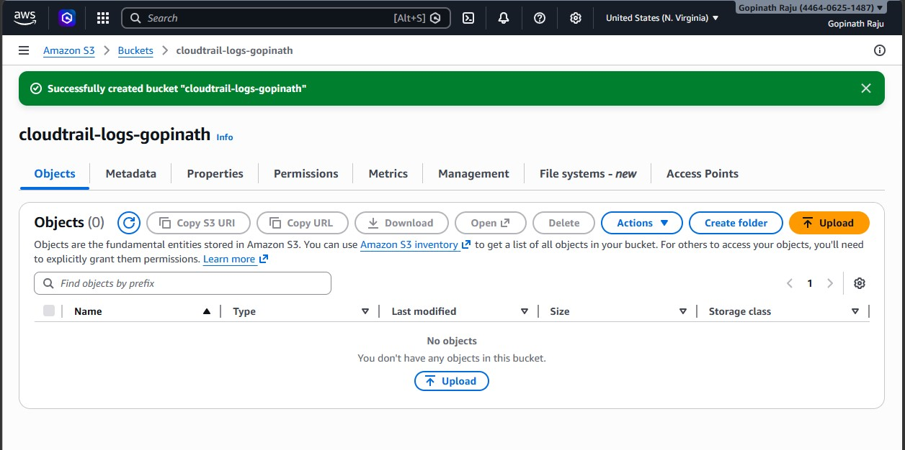
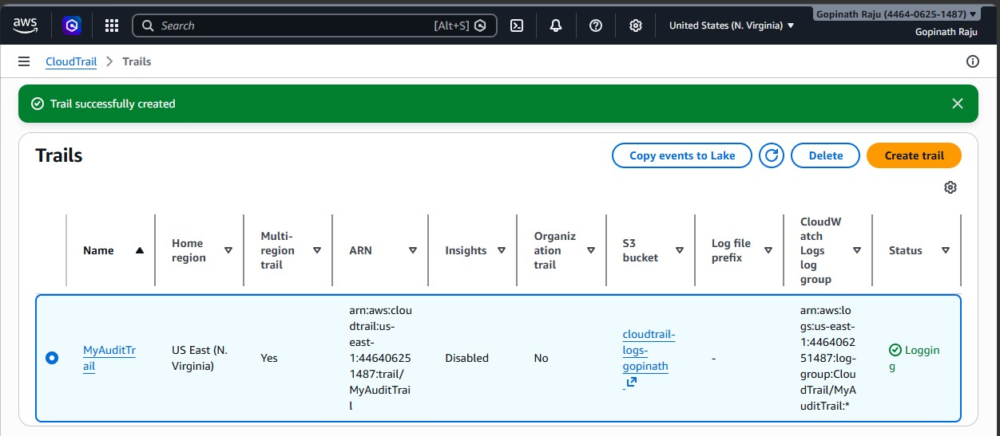
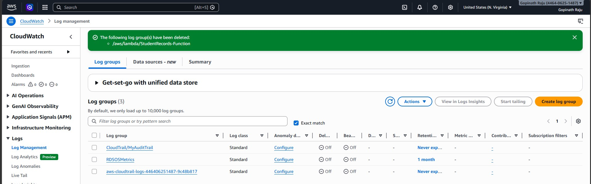
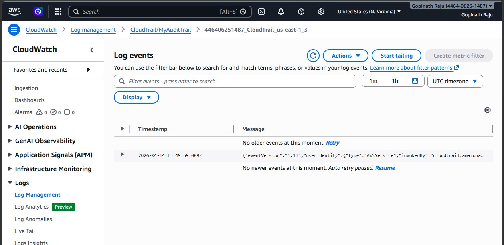
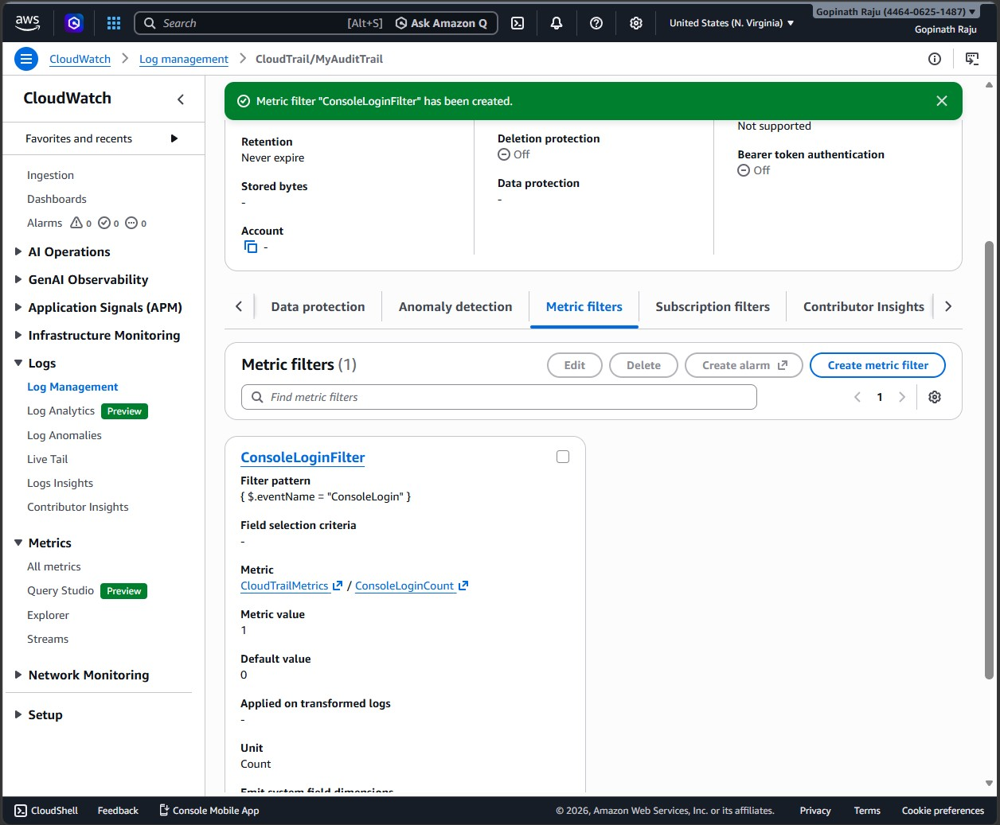
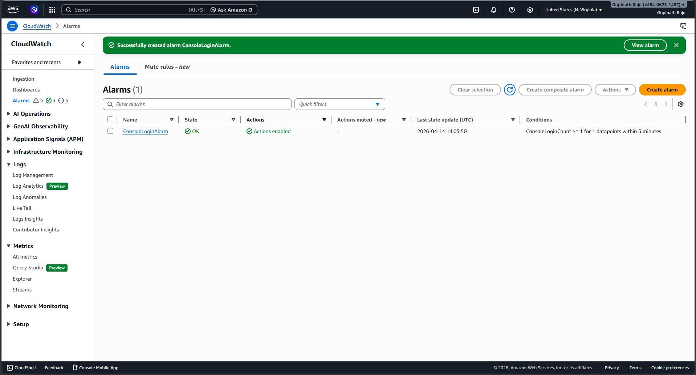
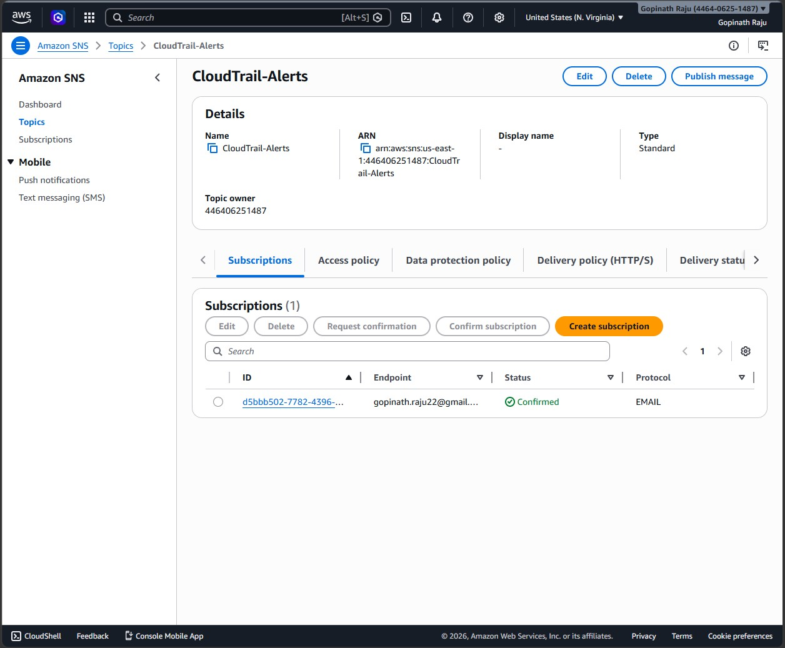
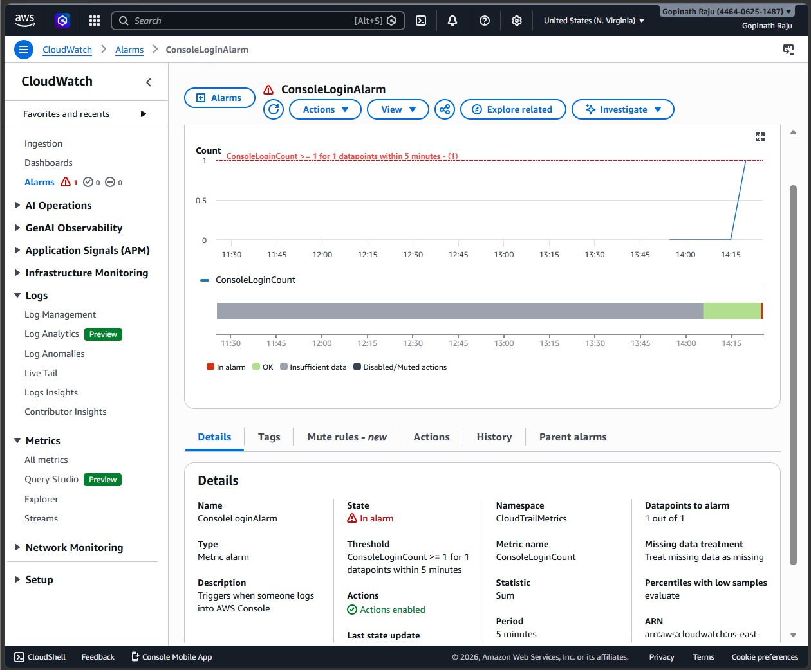
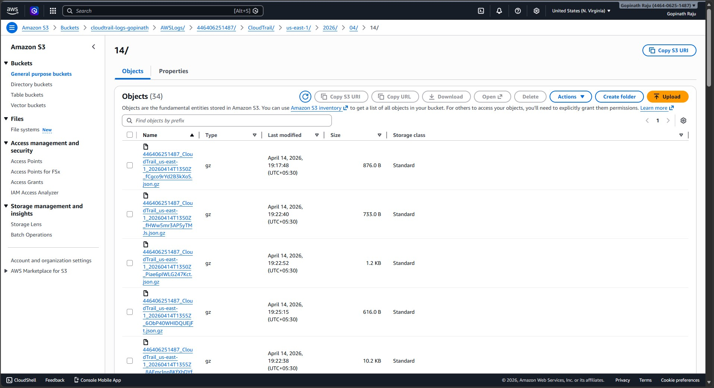

# Centralized Logging & Monitoring System

A hands-on AWS project that centralizes auditing, monitoring, and alerting using **Amazon CloudTrail**, **Amazon CloudWatch**, **Amazon SNS**, and **Amazon S3**.

This project records AWS account activity, sends login alerts by email, and stores audit logs securely in S3 for long-term review.

---

## Project Overview

This solution was built to demonstrate how AWS services can work together for:

- **Auditing** with CloudTrail
- **Monitoring** with CloudWatch Logs, Metric Filters, and Alarms
- **Alerting** with SNS email notifications
- **Log Storage** with Amazon S3

---

## Architecture

```text
AWS Console Activity
        │
        ▼
   AWS CloudTrail
        │
        ├── Sends logs to Amazon S3
        │
        └── Sends events to CloudWatch Logs
                          │
                          ▼
                 Metric Filter detects
                    ConsoleLogin
                          │
                          ▼
                  CloudWatch Alarm
                          │
                          ▼
                    Amazon SNS
                          │
                          ▼
                    Email Alert
```

---

## AWS Services Used

| Service | Purpose |
|---|---|
| Amazon S3 | Stores CloudTrail log files |
| AWS CloudTrail | Captures AWS API and Console activity |
| Amazon CloudWatch Logs | Receives CloudTrail log events |
| CloudWatch Metric Filter | Detects `ConsoleLogin` events |
| CloudWatch Alarm | Triggers when login activity is detected |
| Amazon SNS | Sends alert emails |

---

## Resource Names

| Resource | Name |
|---|---|
| S3 Bucket | `cloudtrail-logs-gopinath` |
| Trail | `MyAuditTrail` |
| Log Group | `CloudTrail/MyAuditTrail` |
| Metric Filter | `ConsoleLoginFilter` |
| Metric Namespace | `CloudTrailMetrics` |
| Metric Name | `ConsoleLoginCount` |
| Alarm | `ConsoleLoginAlarm` |
| SNS Topic | `CloudTrail-Alerts` |

---

## How I Built This

### Step 1 — Created S3 bucket
I created an S3 bucket named `cloudtrail-logs-gopinath` to store CloudTrail logs securely.

### Step 2 — Enabled CloudTrail
I created a trail named `MyAuditTrail` and configured it to send logs to both S3 and CloudWatch Logs.

### Step 3 — Verified CloudWatch Log Group
After enabling CloudTrail, I verified that the log group `CloudTrail/MyAuditTrail` was created and receiving log events.

### Step 4 — Created Metric Filter
I created a metric filter named `ConsoleLoginFilter` using this pattern:

```json
{ $.eventName = "ConsoleLogin" }
```

This counts every AWS Console login event.

### Step 5 — Created CloudWatch Alarm
I created an alarm named `ConsoleLoginAlarm` to trigger whenever `ConsoleLoginCount >= 1` within 5 minutes.

### Step 6 — Configured SNS Notifications
I created an SNS topic named `CloudTrail-Alerts`, subscribed my email, and confirmed the subscription.

### Step 7 — Triggered Real Alert
I signed in to the AWS Console, which generated a real `ConsoleLogin` event. This triggered the CloudWatch alarm and sent an email alert.

### Step 8 — Verified Logs in S3
Finally, I confirmed that CloudTrail log files were being stored in the S3 bucket under the AWSLogs folder structure.

---

## Metric Filter Used

```text
{ $.eventName = "ConsoleLogin" }
```

---

## Alarm Condition

- **Metric:** `ConsoleLoginCount`
- **Namespace:** `CloudTrailMetrics`
- **Statistic:** Sum
- **Period:** 5 minutes
- **Threshold:** Greater than or equal to 1

---

## Security and Monitoring Outcome

This project demonstrates:

- Centralized monitoring of AWS account activity
- Real-time alerting for AWS Console logins
- Long-term audit log storage in S3
- Visibility into cloud events using CloudWatch Logs
- Simple security monitoring using native AWS services

---

## Screenshots

### 1. S3 Bucket Created


### 2. CloudTrail Created


### 3. CloudWatch Log Group


### 4. CloudTrail Log Stream


### 5. Metric Filter Created


### 6. Alarm Created


### 7. SNS Subscription Confirmed


### 8. Alarm Triggered


### 9. Alert Email Received


### 10. CloudTrail Logs Stored in S3


---

## What I Learned

- How CloudTrail records account activity
- How CloudWatch Logs can process CloudTrail events
- How to create metric filters for specific event detection
- How alarms and SNS work together for alerting
- How to store audit logs in S3 for compliance and review

---

## Author

**Gopinath Raju**  
AWS Cloud Learner | Hands-on Projects | Solutions Architect Preparation
